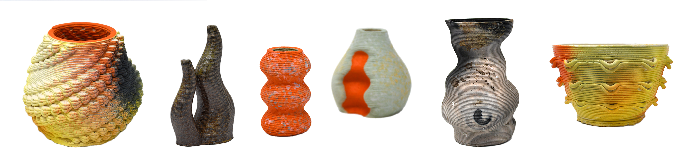

+++
title = 'coilCAM documentation website'
date = 2024-04-13T15:26:38-06:00
draft = false
weight = 1

+++

# What is CoilCAM?

A javascript version of the coilCAM system for clay 3D printing, enabling the use of mathematically-defined toolpaths in the generation of parametric forms and surface textures for 3D-printing ceramics. This web tool, originally developed as a visual scripting plug-in for Grasshopper, is developed by the Expressive Computation Lab at the University of California, Santa Barbara.

# Getting Started
The [about]() page provides a starting point for building forms with CoilCAM, including a basic video tutorial.

The [tutorial]() page demonstrates the effects of different CoilCAM functions using in-browser visualizations.

The [documentation]() page provides a list of CoilCAM functions, with in-browser examples for each one.

The [quickstart]() page demonstrates how to navigate the web editor and Dynamic Toolchains.

The [examples]() page has several example forms created with CoilCAM. 

