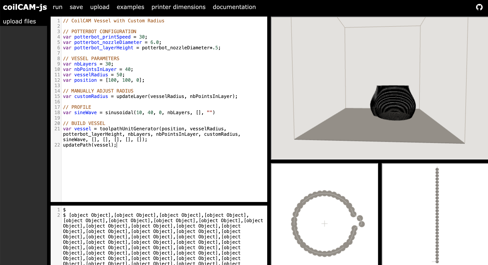
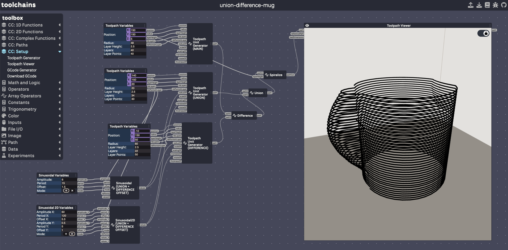

+++
title = 'quick start'
date = 2024-04-13T15:42:11-06:00
draft = false
weight = 4
[params]
  math = true
+++


## CoilCAM-js 
There are three separate ways to use CoilCAM-js functions. Users can install the javascript library using npm, experiment with functions through the web editor, or experiment with functions using the cc-toolchains branch of Dynamic Toolchains.

### Javascript Library
[Source code](https://github.com/sambourgault/coilCAM-js)

CoilCAM-js is a javascript library that implements core functionalities present in the original CoilCAM library. To use CoilCAM-js functions in your own work, run ```npm install coilcam```, or access the library [through npm](https://www.npmjs.com/package/coilcam).

### Web Editor
<div class="table-container">

|  | 
|:--:| 
| *[Web Editor Quick Start]()*|

</div>

The CoilCAM-js web editor lets users work with CoilCAM-js functions in their browser. In the web editor, users can design, visualize and save toolpaths as .gcode files.


### Toolchains
<div class="table-container">

|  |  
|:--:|  
| *[Toolchains Quick Start]()* |

</div>

CoilCAM-js functions are also accessible through [Dynamic Toolchains](https://dl.acm.org/doi/fullHtml/10.1145/3526114.3558662), a visual development environment developed by Hannah Twigg-Smith. The CoilCAM-js branch of Dynamic Toolchains (cc-toolchains) is accessible through GitHub [here](https://github.com/epuzio/cc-toolchains).

*Integration with Dynamic Toolchains + editable examples coming soon!*

### CoilCAM
[Source code](https://github.com/sambourgault/coilCAM)

The original version of CoilCAM is accessible as a scripting plug-in for Grasshopper, a visual programming language for Rhino. Additional information about this version is available [here](https://ecl.mat.ucsb.edu/publication/coilcam).


<!-- Table styling -->
<style>
.table-container {
  width: 80%;
  margin: auto;
}
</style>