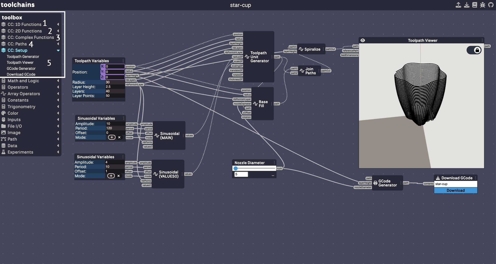

+++
title = 'toolchains'
date = 2024-04-13T15:42:11-06:00
draft = false
weight = 10
[params]
  math = true
+++


# Dynamic Toolchains
This tutorial demonstrates how to navigate the CoilCAM-js branch of Dynamic Toolchains, a visual programming environment. [Dynamic Toolchains can be found here](https://github.com/machineagency/toolchains).
*Integration with Dynamic Toolchains coming soon*

## Running Locally
To install Dynamic Toolchains, visit the [cc-toolchains](https://github.com/epuzio/cc-toolchains) branch and clone the repository. Run ```npm install``` to install dependenceies and ```npm run dev``` to start the development server.


## Building a Toolchain


CoilCAM functions can be found at the top of the toolbox menu on the left. They are divided into 5 categories: 
1. 1D functions (sinusoidal, linear, exponential, staircase, square)
2. 2D functions (sinusoidal 2D, linear 2D)
3. Complex functions (custom profile, custom radius)
4. Path manipulation (spiral base, filled base, join paths, union boolean operator, difference boolean operator, spiralize path, center print)
5. Setup (toolpath unit generator, toolpath viewer, gcode generator, download gcode)

In most cases, clicking a CoilCAM function will also add a default variables component for that function. The default variables component contains standard input sliders for the function. However, additional input sliders can be found under the inputs tab.

## Menu Navigation


The upper menu of Dynamic Toolchains contains the following options:
1. upload: Constructs a toolchain from a .json file.
2. download: Downloads the current toolchain as a .json file.
3. examples: Provides example toolchains for different fabrication pipelines. CoilCAM-relevant examples are marked as "CC".
4. debug: Opens the debug console.
5. github: Links to the Dynamic Toolchains source code.



When you are satisfied with your changes, press the Download GCode button to download your toolpath as a gcode file. 

## Additional Resources
.json files for certain examples are available through the [examples]() tab. Upload these files to Dynamic Toolchains to modify their properties. 
The example toolchain used in this quick start can be <a href="/data/example-cup.json" download="example-cup.json">downloaded here</a>.


