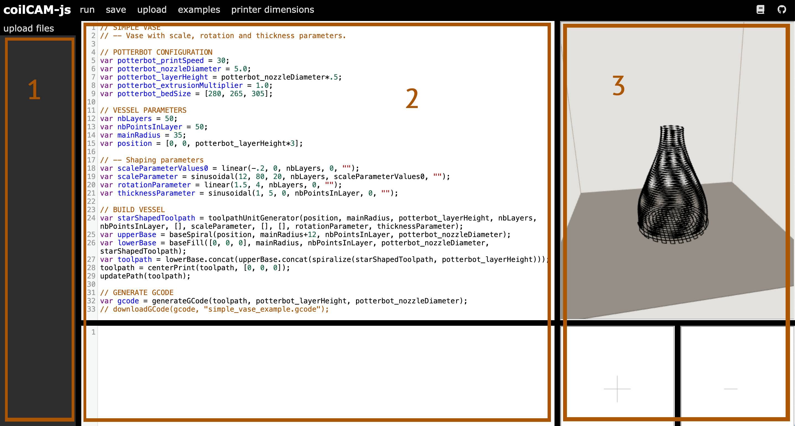
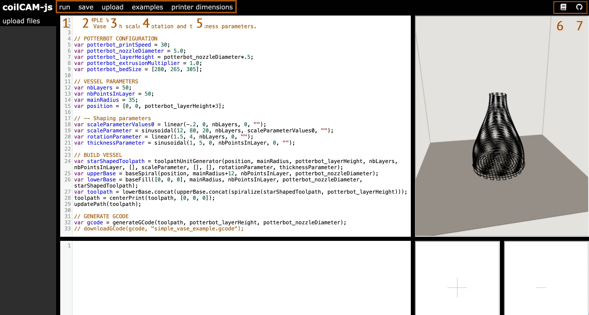

+++
title = 'web editor'
date = 2024-04-13T15:42:11-06:00
draft = false
weight = 10
[params]
  math = true
+++

# Web Editor
This tutorial demonstrates how to navigate the [CoilCAM-js web editor](https://sambourgault.github.io/coilCAM-js/).

## Layout

The web editor is divided into three sections:
1. File upload
2. Code editor 
3. Toolpath visualizer 

At the top is a menu bar containing the following options:

1. run: Runs the code in the code editor, prints errors to the console.
2. save: Saves the code in the code editor as a .txt file.
3. upload: Uploads .txt files to the code editor.
4. examples: Provides a list of example vessels to experiment with.
5. printer dimensions: Changes the printer dimensions in the toolpath visualizer.
6. documentation: Links to the documentation site.
7. github: Links to the CoilCAM-js source code.

Try selecting the "demo vase" example from the dropdown. Then, make changes to the scalingParameter, layerRotation and thicknessParameter and press the "run" button to see those changes reflected in the toolpath visualizer. When you are satisfied with your changes, uncomment the generateGCode and downloadGCode lines and press "run" to download your toolpath as a gcode file.


